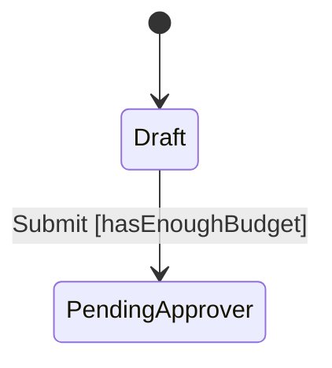
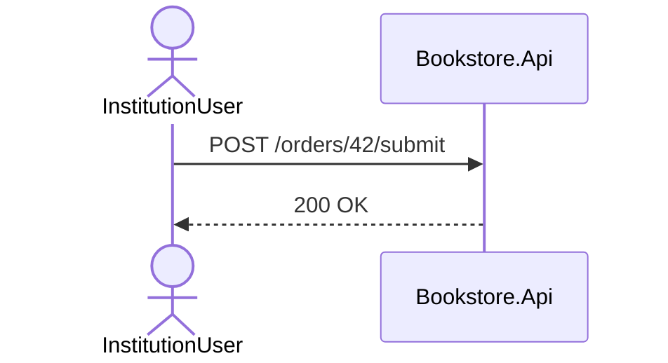

# Institutional ordering module

States of an institutional order:

```mermaid
stateDiagram-v2
    [*] --> Draft
    Draft --> PendingApprover: Submit [hasEnoughBudget]
```

Who submits the order:

```mermaid
sequenceDiagram
    actor User as InstitutionUser
    participant Api as Bookstore.Api
    User->>Api: POST /orders/42/submit
    Api-->>User: 200 OK
```
